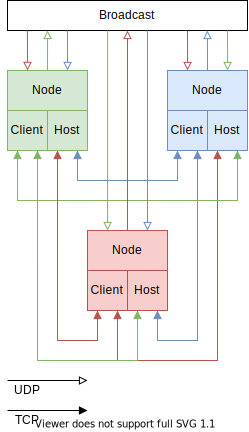
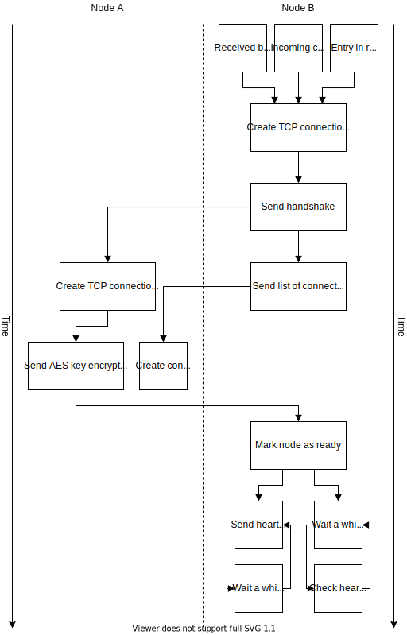

# Lancaht 2 guide

Version 2.0.0.2007

## How it works

### Node

Lanchat instances are called nodes. Every node has separated TCP client and host. 
They also use UDP broadcasts to detect other nodes on the network.

### Connection

There are three ways to establish connection between two nodes.

* Broadcast
* Nodes list
* Manual

### Heartbeat

Nodes send blank package every second for detect broken connections. 
If node doesn't receive heartbeat within the time specified in config (5 seconds in default) it closes socket.